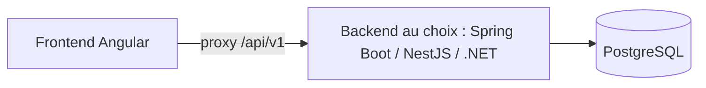

# Architecture

La forme technique macro : la stack, comment les pièces s'assemblent, et les décisions derrière. Pointer vers le code, pas le restater.

## Stack

- Backend : **3 implémentations équivalentes au choix** — Spring Boot (Java 21, `backend/springboot`), NestJS (`backend/nestjs`, Prisma), .NET 8 (`backend/dotnet`).
- Frontend : Angular (standalone), Tailwind CSS, RxJS — `frontend/`.
- Base de données : PostgreSQL, migrations Liquibase (côté Spring Boot).

## Comment ça s'assemble

Le frontend Angular appelle le backend choisi via un proxy (`proxy.conf.json`), qui expose l'API `/api/v1` au-dessus de PostgreSQL.

## Décisions clés

- Trois backends équivalents et actifs : tout changement d'API métier doit se répercuter dans les trois, ou être rendu dans un seul si le travail le borne explicitement.
- Architecture hexagonale côté Spring Boot : `application` (dao, service), `domain`, `infrastructure` — reproduire cet esprit dans les autres backends.

## Pièges

- Le backend « actif » n'est pas unique : ne pas supposer Spring Boot par défaut, vérifier quelle variante le travail vise.
- `backend/nestjs/generated/` contient du code généré (Prisma) : ne pas éditer à la main.
