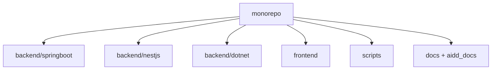

# Codebase Map

La disposition macro : les zones de premier niveau et ce que chacune contient. Une carte pour naviguer, pas l'arbre complet.

## Zones

- `backend/springboot` : API Spring Boot (variante principale de référence), hexagonale (`application`, `domain`, `infrastructure`).
- `backend/nestjs` : API NestJS équivalente, ORM Prisma (`prisma/`, code dans `generated/`).
- `backend/dotnet` : API .NET 8 équivalente (`src/TaskManager`).
- `frontend` : application Angular 19 (zone `ui` : `kanban`, `task-card`, `task-form`).
- `scripts/` : automatisation (`run.sh`, `build.sh`, `test.sh`, `setup-db.sh`).
- `docs/` : documentation projet (bootstrap, architecture). `aidd_docs/` : mémoire et contexte IA.

## Points d'entrée

- Spring Boot : `backend/springboot/src/main/java/com/neosoft/practice_software/TaskManagerApplication.java`
- Frontend : `frontend/src/main.ts`
- Lancement complet : `./scripts/run.sh` (backend + frontend en parallèle)

## Packages

- Monorepo sans workspace npm racine : chaque backend a son propre manifeste, le frontend le sien.
