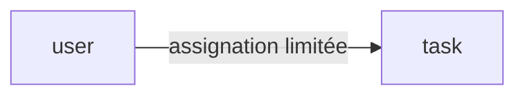

# Database

Le magasin de données : son type, les entités principales et les conventions. Le modèle macro, pas le schéma complet.

## Setup

- PostgreSQL, migrations Liquibase (côté Spring Boot), Prisma (côté NestJS). Config dans `backend/springboot/src/main/resources` et `backend/nestjs/prisma/`.
- Lancement local : `./scripts/setup-db.sh` (PostgreSQL via Docker).

## Entités principales

Les racines d'agrégat et le regroupement des entités. Pointer vers `docs/Architecture/db-design.md` pour les colonnes et les clés.

## Conventions

- Migrations Liquibase : toute modification de schéma passe par un changelog, jamais à la main.
- Schéma de référence généré : `docs/Architecture/db-design.md`.
