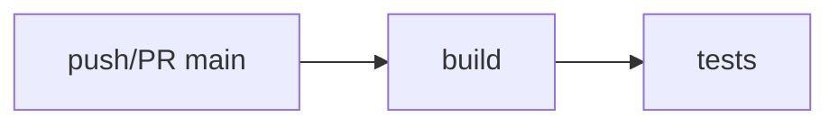

# Deployment

Où le projet tourne et comment il se livre : CI/CD, environnements et release.

## Pipeline

- GitHub Actions (`.github/workflows/build.yml`) : build + tests des 4 variantes (Spring Boot, NestJS, .NET, Angular) sur push et PR vers `main`.
- Pas de déploiement automatique en place : la CI vérifie, elle ne livre pas.

## Environnements

- Local uniquement : `./scripts/run.sh` (backend + frontend), `./scripts/setup-db.sh` (PostgreSQL via Docker).

## Release

- Pas de procédure de release en place.

## Monitoring

- Rien de câblé ; les référentiels d'intention vivent dans `docs/Bootstrap/8 - Observabilite.md`.
