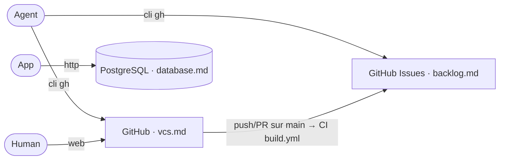

# Ecosystem

```mermaid
flowchart LR
    Human([Human])
    Agent([Agent])
    App([App])
    Vcs["GitHub · vcs.md"]
    Tracker["GitHub Issues · backlog.md"]
    DB[(PostgreSQL · database.md)]

    Agent -- cli gh --> Vcs
    Agent -- cli gh --> Tracker
    Human -- web --> Vcs
    App -- http --> DB

    Vcs -- "push/PR sur main → CI build.yml" --> Tracker
```
