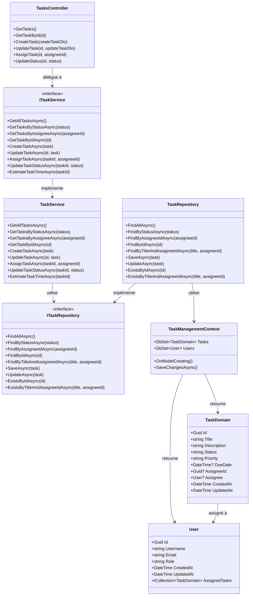
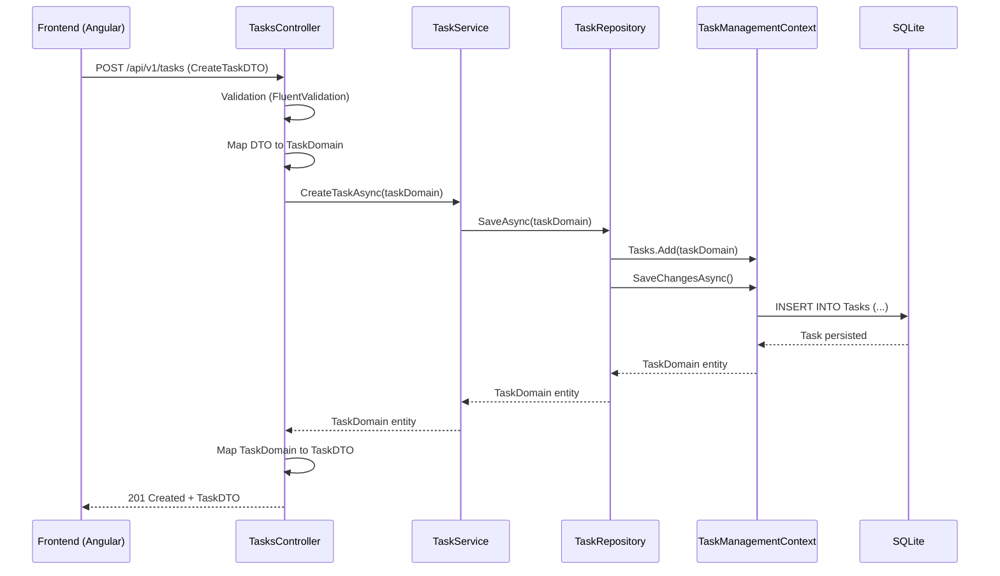

### 📌 Diagramme de class - Clean Archi

---

### 📂 Mise en correspondance des namespaces

| Élément | Namespace / Project |
|--|--|
| `TasksController` | `TaskManager.API.Controllers` |
| `ITaskService` | `TaskManager.Application.Service` |
| `TaskService` | `TaskManager.Application.Service` |
| `ITaskRepository` (interface) | `TaskManager.Application.Interface` |
| `TaskRepository` | `TaskManager.Infrastructure.Repository` |
| `TaskManagementContext` | `TaskManager.Infrastructure.EFCore` |
| `TaskDomain`, `User` | `TaskManager.Domain.Models` |
| **DTOs** | `TaskManager.API.Dtos` |
| **Validators** | `TaskManager.API.Validators` |
| **Mappers** | `TaskManager.API.Mapper` |
| **Exceptions** | `TaskManager.Domain.Exceptions` |

---

### 📌 Use Case : Création d'une tâche (`POST /api/v1/tasks`)

---

### 🏗️ Architecture détaillée

#### Couche API (TaskManager.API)
- **Controllers**: Points d'entrée REST (TasksController, UsersController)
- **DTOs**: Objets de transfert (CreateTaskDTO, TaskDTO, ErrorResponse)
- **Validators**: Validation avec FluentValidation (CreateTaskValidator)
- **Mappers**: Extensions de mapping (TaskExtensions, UserExtensions)
- **Exception Handling**: GlobalExceptionHandler pour gérer les erreurs

#### Couche Application (TaskManager.Application)
- **Services**: Logique métier (TaskService, UserService)
- **Interfaces**: Contrats de service (ITaskService, IUserService)
- **Repository Interfaces**: Contrats d'accès aux données (ITaskRepository, IUserRepository)

#### Couche Infrastructure (TaskManager.Infrastructure)
- **Repositories**: Implémentations EF Core (TaskRepository, UserRepository)
- **DbContext**: Configuration EF Core (TaskManagementContext)
- **Migrations**: Gestion du schéma de base de données
- **Seeding**: Données initiales (TaskManagementContextSeed)

#### Couche Domain (TaskManager.Domain)
- **Models**: Entités métier (TaskDomain, User)
- **Exceptions**: Exceptions métier (FunctionalException, TechnicalException)

---

### 🔄 Flux de données

1. **Requête HTTP** → Controller (API Layer)
2. **Validation** → FluentValidation
3. **Mapping DTO → Domain** → Extension methods
4. **Logique métier** → Service (Application Layer)
5. **Accès aux données** → Repository (Infrastructure Layer)
6. **ORM** → Entity Framework Core
7. **Base de données** → SQLite
8. **Retour** → Domain → DTO → JSON Response

---

### 🎯 Principes appliqués

- **Separation of Concerns**: Chaque couche a une responsabilité claire
- **Dependency Inversion**: Les dépendances pointent vers les abstractions
- **Interface Segregation**: Interfaces spécifiques et cohérentes
- **Single Responsibility**: Chaque classe a une seule raison de changer
- **Testabilité**: Architecture facilement testable avec mocking
