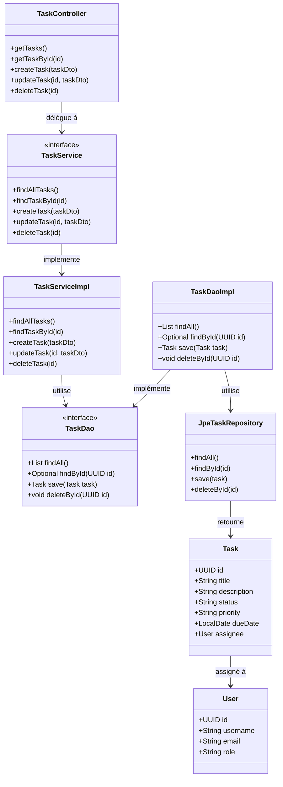
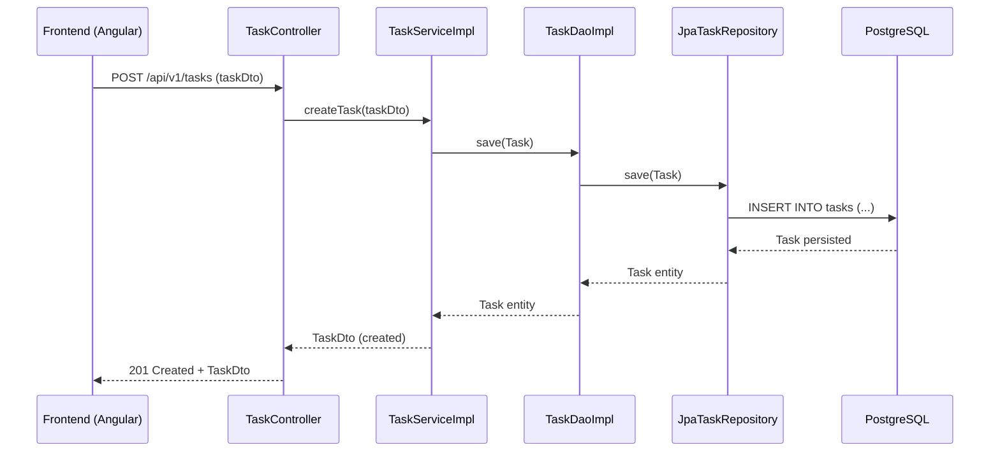

### 📌 Diagramme de class - Clean Archi

---

### 📂 Mise en correspondance des packages

| Élément | Package |
|--|--|
| `TaskController` | `infrastructure.api` |
| `TaskService` | `application.service` |
| `TaskServiceImpl` | `application.service.impl` |
| `TaskDao` (interface) | `application.dao` |
| `TaskDaoImpl` | `infrastructure.jpa.dao` |
| `JpaTaskRepository` | `infrastructure.jpa.repository` |
| `Task`, `User` | `domain.model` |

---

Parfait ! Voici un **diagramme de séquence** basé sur l’architecture Clean que tu as fournie et le **use case de création d’une tâche (`POST /api/v1/tasks`)**.

---

### 📌 Use Case : Création d’une tâche (`POST /api/v1/tasks`)

---

