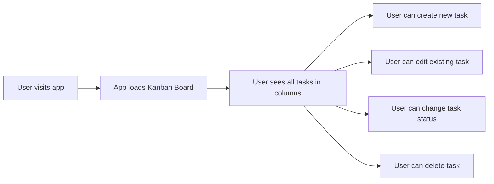

# Frontend Initialization Plan

**Generated:** Wed Feb 25 2026 14:55:29 UTC
**Feature:** Frontend Angular 19 Task Management Initialization
**Type:** Simple Plan

---

## 1. Requirements Summary

Initialize the frontend Angular 19 application in `@frontend/` using:
- Documentation in `@docs/`
- Data model defined in `@docs/Architecture/db-design.md`
- API endpoints defined in `@docs/Architecture/url-api-structure.md`

### User Journey

---

## 2. Implementation Phases

### Phase 1: Core Configuration
- [ ] Configure HttpClient in `app.config.ts`
- [ ] Set up routing in `app.route.ts`
- [ ] Clean up `app.component.html` with `<router-outlet />`

### Phase 2: User Domain & Service
- [ ] Create User model in `domain/model/user.model.ts`
- [ ] Create User service in `application/service/user.service.ts`

### Phase 3: UI Components
- [ ] Create TaskCardComponent for task display
- [ ] Create TaskFormComponent for create/edit modal

### Phase 4: Integration & Testing
- [ ] Verify Kanban board loads tasks from backend
- [ ] Test CRUD operations
- [ ] Run `npm test` to verify no regressions

---

## 3. Dependencies & Configuration

### Required Packages (already in package.json)
- Angular 19.1.0
- TailwindCSS 4.0.4
- RxJS 7.8.0

### API Configuration
- Backend API: Spring Boot on port 8080
- Proxy: `/api` → `http://localhost:8080`
- Base path: `/api/v1/`

---

## 4. Risk Assessment

| Risk | Likelihood | Mitigation |
|------|------------|------------|
| Backend not running | Medium | Start backend first or show clear error |
| Missing user data | Low | Backend has default users from Liquibase |
| HTTP interceptor needs | Low | Can add later if needed |

---

## 5. Confidence Assessment

**Confidence Score:** 9/10

### ✅ High Confidence Reasons
1. Frontend structure already exists with domain/application/ui separation
2. Task model and service already implemented
3. Kanban board component already exists
4. Backend API structure is clear and stable
5. Angular 19 with TailwindCSS already configured

### ❌ Risks / Concerns
1. HttpClient not configured yet - will fail without `provideHttpClient()`
2. Missing components (TaskCard, TaskForm) - referenced in Kanban template
3. No user service exists yet - needed for task assignment feature

---

## 6. Files to Create/Modify

### Create
- `frontend/src/app/domain/model/user.model.ts`
- `frontend/src/app/application/service/user.service.ts`
- `frontend/src/app/ui/task-card/task-card.component.ts`
- `frontend/src/app/ui/task-card/task-card.component.html`
- `frontend/src/app/ui/task-form/task-form.component.ts`
- `frontend/src/app/ui/task-form/task-form.component.html`

### Modify
- `frontend/src/app/app.config.ts` - Add HttpClient provider
- `frontend/src/app/app.route.ts` - Add routing
- `frontend/src/app/app.component.html` - Clean up
- `frontend/src/app/ui/kanban/kanban-board.component.html` - Add missing component references

---

## 7. Success Criteria

- [ ] Application compiles without errors (`npm run build`)
- [ ] Kanban board displays tasks from backend
- [ ] User can create, edit, delete tasks
- [ ] Status changes reflect immediately in UI
- [ ] All tests pass (`npm test`)